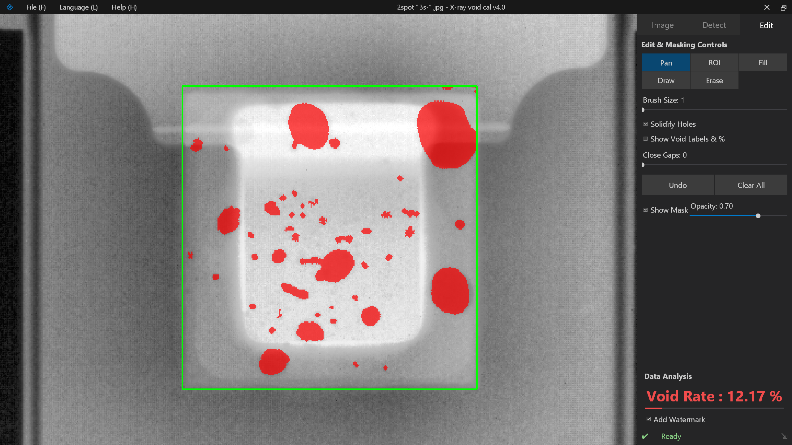
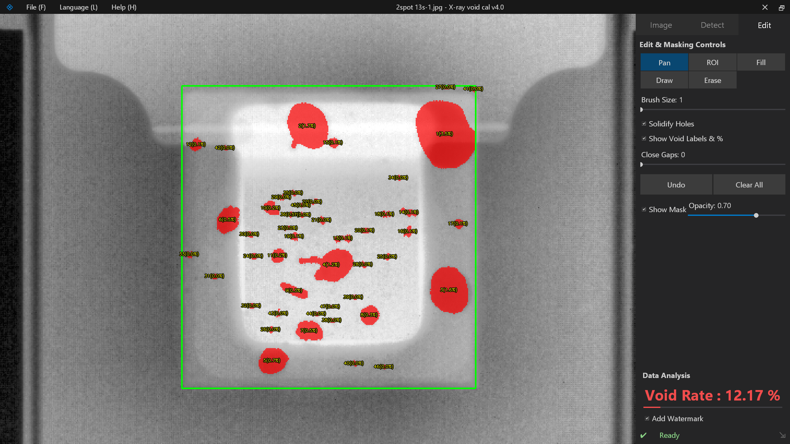
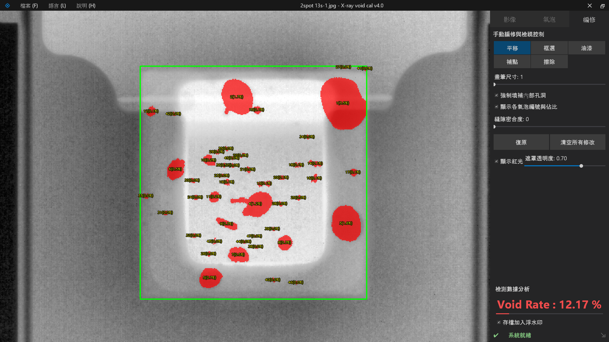
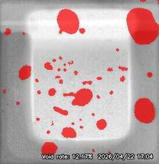

# X-ray Void Calculator v4.0 python and web version  (AOI 氣泡空洞率檢測分析軟體)


[繁體中文](#繁體中文-traditional-chinese) | [简体中文](#简体中文-simplified-chinese) | [English](#english) | [日本語](#日本語-japanese) | [한국어](#한국어-korean) | [Français](#français-french) | [Deutsch](#deutsch-german)

---

## 軟體截圖 (Screenshots)





---

## 🌐 介面語言支援 (Supported Languages)
本軟體介面已完整翻譯並支援以下 7 種語言，可隨時於選單中切換：
* 繁體中文 (Traditional Chinese)
* 簡體中文 (Simplified Chinese)
* 英文 (English)
* 日本語 (Japanese)
* 한국어 (Korean)
* Français (French)
* Deutsch (German)

---

## 繁體中文 (Traditional Chinese)

這是一款專為半導體封裝、SMT 銲錫點及工業 X-ray 影像設計的 **AOI (自動光學檢測)** 輔助軟體。它能自動辨識影像中的氣泡空洞，並精確計算其佔比 (Void Rate)。

### ✨ 核心功能
* **多國語言介面**：支援繁中、簡中、英、日、韓、法、德語即時切換。
* **AI 智能最佳化**：整合 **Otsu (大津演算法)**，一鍵自動分析影像背景並設定最完美的氣泡切割閾值。
* **像素級邊界防護**：導入 **Bilateral Filter (雙邊濾波)**，在消除雜訊的同時，完美保留氣泡最銳利的真實物理輪廓。
* **無死角攝影機系統**：支援極致順暢的縮放 (Zoom) 與平移 (Pan)，輕鬆觀察微小瑕疵。
* **全方位編修工具**：提供框選 ROI、手動補點、橡皮擦，以及智慧油漆桶填滿功能。
* **專業報表匯出**：一鍵產生包含氣泡編號、各別佔比、總空洞率及時間浮水印的高畫質報表。

### 🛠️ 安裝與執行
1. **環境要求**：Python 3.8+ (建議使用 3.12)。
2. **安裝套件**：
   ```bash
   pip install opencv-python pillow numpy
   ```
3. **執行程式**：
   ```bash
   python main.py
   ```

---

## 简体中文 (Simplified Chinese)

这是一款专为半导体封装、SMT 焊锡点及工业 X-ray 影像设计的 **AOI (自动光学检测)** 辅助软件。它能自动识别影像中的气泡空洞，并精确计算其占比 (Void Rate)。

### ✨ 核心功能
* **多国语言界面**：支持繁中、简中、英、日、韩、法、德语切换。
* **AI 智能优化**：整合 **Otsu (大津算法)**，自动寻找最佳类间方差作为阈值。
* **像素级边界防护**：导入 **Bilateral Filter (双边滤波)**，完美保留锐利边缘。

---

## English

A specialized **AOI (Automated Optical Inspection)** assistant software designed for semiconductor packaging, SMT solder joints, and industrial X-ray imaging. It automatically detects voids and accurately calculates the **Void Rate**.

### ✨ Key Features
* **Multi-language Interface**: Supports Traditional Chinese, Simplified Chinese, English, Japanese, Korean, French, and German.
* **AI Optimization**: Integrated **Otsu's Method** for one-click background analysis and optimal thresholding.
* **Bilateral Filtering**: Implements pixel-perfect edge protection to eliminate noise while preserving sharp boundaries.
* **Professional Report Export**: Generates high-resolution reports with individual bubble percentages and total void rate.

---

## 日本語 (Japanese)

産業用X線画像向けに設計された **AOI（自動光学検査）** 支援ソフトウェアです。画像内のボイド（気泡）を自動的に検出し、そのボイド率（Void Rate）を正確に計算します。

### ✨ 主な機能
* **多言語対応**：繁体字、簡体字、英語、日本語、韓国語、フランス語、ドイツ語の切り替えに対応。
* **AI 自動最適化**：**大津の2値化**を統合し、最適な閾値をワンクリックで設定します。
* **ピクセルレベルのエッジ保護**：**バイラテラルフィルタ**でノイズを除去し、エッジを鋭く保ちます。

---

## 한국어 (Korean)

산업용 X-ray 이미지를 위해 설계된 **AOI (자동 광학 검사)** 보조 소프트웨어입니다. 이미지 내의 보이드(기포)를 자동으로 감지하고 보이드 비율(Void Rate)을 정확하게 계산합니다.

### ✨ 주요 기능
* **다국어 인터페이스 지원**: 번체/간체 중국어, 영어, 일본어, 한국어, 프랑스어, 독일어를 지원합니다.
* **AI 자동 최적화**: **오츠의 방법 (Otsu's Method)** 을 통합하여 배경을 분석하고 최적의 임계값을 자동으로 설정합니다.
* **픽셀 수준의 엣지 보호**: **양방향 필터 (Bilateral Filtering)** 를 적용하여 노이즈를 제거하면서도 물리적 경계를 날카롭게 유지합니다.

---

## Français (French)

Un logiciel d'assistance **AOI (Inspection Optique Automatisée)** conçu pour l'imagerie aux rayons X industrielle. Il détecte automatiquement les vides et calcule avec précision le taux de vide (Void Rate).

### ✨ Caractéristiques Principales
* **Interface multilingue** : Prise en charge du chinois (traditionnel/simplifié), de l'anglais, du japonais, du coréen, du français et de l'allemand.
* **Optimisation IA** : Intègre la **méthode d'Otsu** pour analyser le fond et définir le seuil optimal en un clic.
* **Protection des bords** : Implémente le **filtrage bilatéral** pour éliminer le bruit tout en préservant des limites physiques nettes.

---

## Deutsch (German)

Eine **AOI (Automatisierte Optische Inspektion)** Assistenzsoftware für industrielle Röntgenbilder. Sie erkennt automatisch Hohlräume (Voids) und berechnet präzise die Void-Rate.

### ✨ Hauptmerkmale
* **Mehrsprachige Benutzeroberfläche**: Unterstützt Chinesisch (traditionell/vereinfacht), Englisch, Japanisch, Koreanisch, Französisch und Deutsch.
* **KI-Optimierung**: Integriert die **Otsu-Methode**, um den Hintergrund automatisch zu analysieren und den optimalen Schwellenwert festzulegen.
* **Pixelgenauer Kantenschutz**: Implementiert **bilaterale Filterung**, um Rauschen zu eliminieren und scharfe physikalische Grenzen zu erhalten.

---

## 🧠 演算法原理 (Principles & Algorithms)
1. **黑帽特徵提取 (Blackhat)**：有效排除曝光不均的背景，僅提取比周圍暗的孔洞特徵。
2. **大津演算法 (Otsu's Method)**：透過數學統計像素直方圖，自動尋找最佳類間變異數作為閾值。
3. **雙邊濾波邊緣防護 (Bilateral Filter)**：取代傳統形態學，避免邊緣被過度磨圓導致空洞率失真。
4. **連通域分析 (CCL)**：對氣泡進行幾何過濾 (面積與圓形度)，排除非瑕疵雜訊。

---

## 📜 開源宣告與致謝 (Acknowledgments)
本專案依賴於以下優秀開源專案 / This project relies on the following open-source projects:
* **[OpenCV](https://opencv.org/)** (Apache License 2.0)
* **[NumPy](https://numpy.org/)** (BSD 3-Clause License)
* **[Pillow](https://python-pillow.org/)** (HPND License)

本軟體採用 **GPLv3 License** 授權。您可以自由使用、修改與散佈，但任何基於本專案的衍生作品必須同樣以 GPLv3 協議開源。詳情請參閱 `LICENSE.md`。